# AWS Secure Enterprise Three-Tier Web Architecture Deployment

An enterprise-grade, high-availability, and network-isolated three-tier web application infra architecture deployed within the Amazon Web Services (AWS) Mumbai (`ap-south-1`) region. This framework separates responsibilities across dedicated Public and Private boundaries to ensure complete network protection for business critical dynamic application workflows.

---

## 🏗️ Structural Design & Topology Blueprint

The infrastructure segregates systemic tiers across isolated network boundaries within a custom Virtual Private Cloud (VPC) to restrict direct exposure to the public internet:
1. **Web / Proxy Tier (Public Subnet):** Hosts an Nginx web server acting as a reverse proxy gateway to terminate public client sessions.
2. **Application Tier (Private Subnet 1):** Hosts an Apache Tomcat 9 execution engine running a dynamic Java Servlet Student Registration engine.
3. **Database Tier (Private Subnet 2):** Hosts a fully managed Amazon RDS MariaDB database cluster completely unexposed to internet paths.

### 🗺️ Infrastructure Architecture Diagram
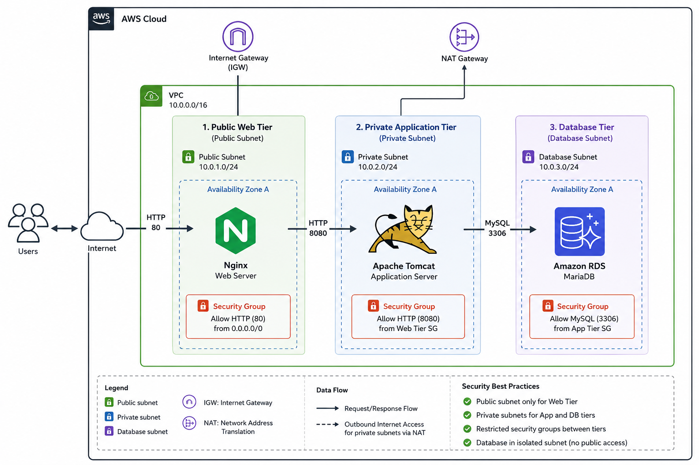

---

## 🛠️ Step-by-Step Production Deployment Logs

### Phase 1: Core Networking & Custom VPC Fabric Setup

1. **VPC Core Initialization:** Provisioned a custom VPC wrapper named `three-tier-VPC` in the `ap-south-1` region with an expansive `10.0.0.0/16` CIDR block block to provide long-term subnet scaling capabilities.
   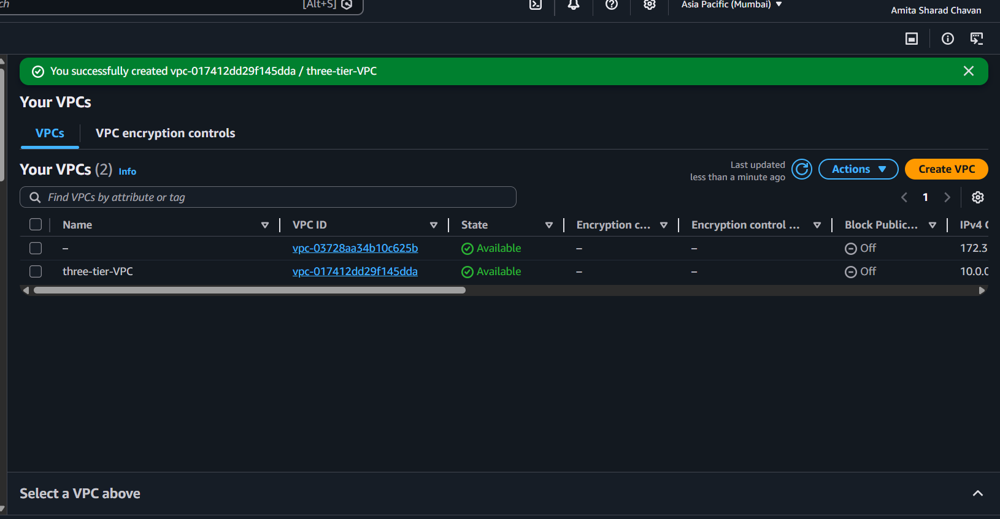

2. **Subnet Fragmentation:** Carried out strategic zone isolation by creating three custom subnets across distinct Availability Zones (AZs):
   * `public subnet-ap-south-1a` (Web/Ingress layer)
   * `private subnet1 – south-1b` (Tomcat application computation space)
   * `private subnet – south-1c` (MariaDB storage cluster domain)
   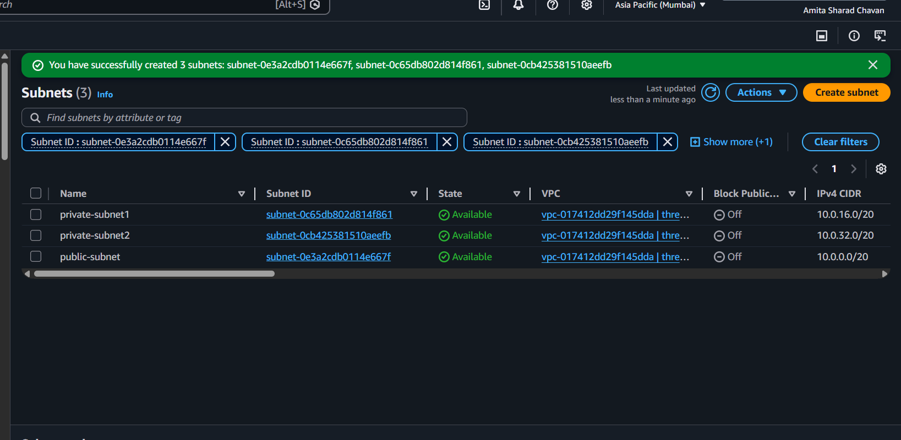

3. **Public Network Enablement:** Modified the runtime properties of the Public Subnet node to enable **Auto-assign Public IPv4** configurations, forcing edge routers to pick up public internet IPs cleanly.
   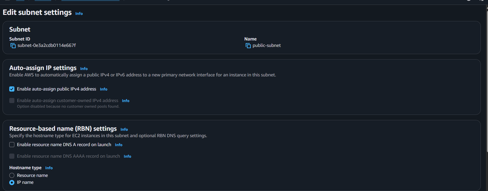

4. **Edge Internet Gateway Linkage:** Created an external-facing **Internet Gateway (IGW)** tagged as `three-tier-igw` and permanently mounted it onto the custom VPC block.
   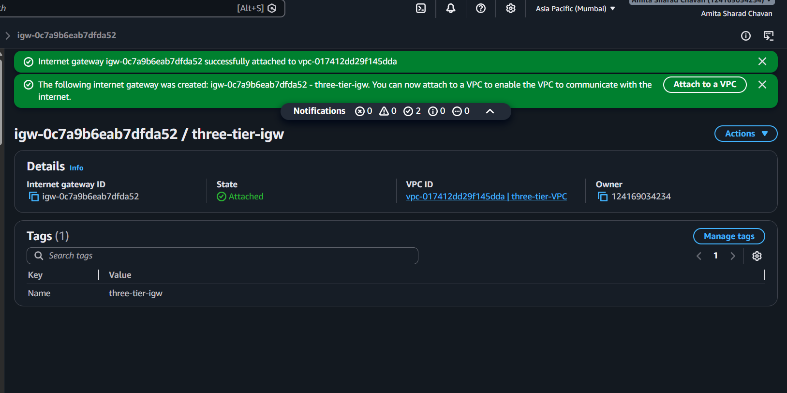

5. **Edge Route Registration:** Injected a public routing default entry pointing destination `0.0.0.0/0` straight to the Internet Gateway instance within the primary Public Route Table (`public-rt`).
   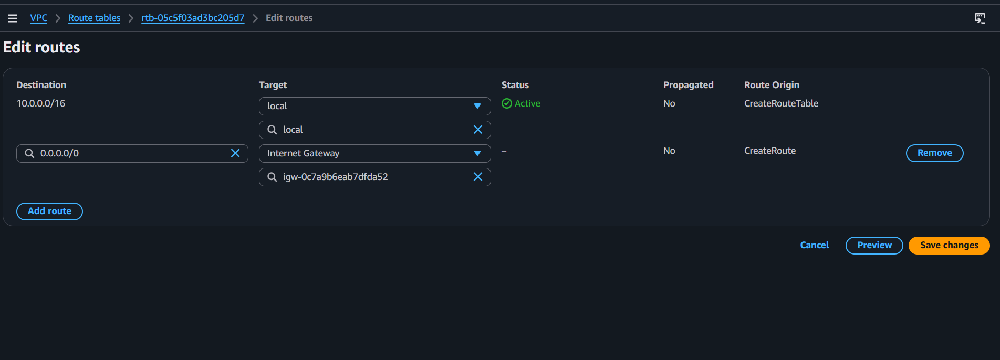

6. **Subnet Forwarding Configurations:** Associated the subnet pathways to allow explicit ingress path definitions.
   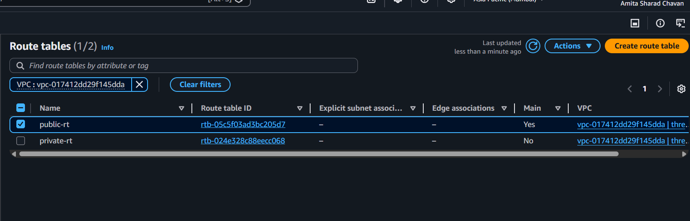
   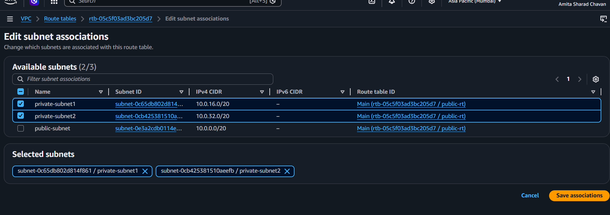

7. **Zonal NAT Gateway Allocation:** Provisioned an AWS **NAT Gateway** (`three-tier-NAT`) backed by an allocated Elastic IP inside the Public Subnet to route private egress commands without exposing private interfaces.
   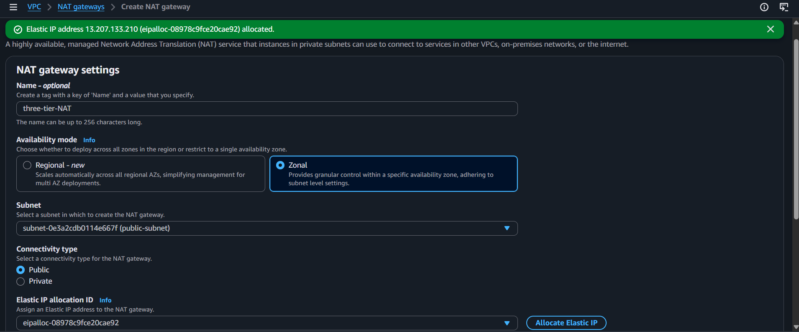

8. **Private Route Mapping:** Injected a `0.0.0.0/0` route rule within the Private Route Table (`private-rt`) linking to the NAT Gateway so backend compute clusters can call system upgrade package lines safely.
   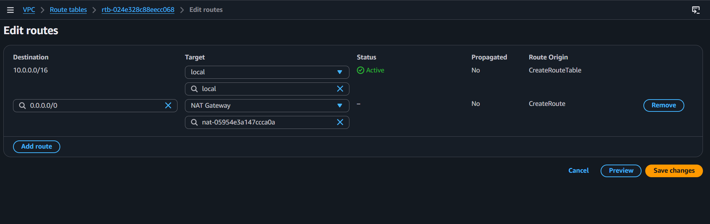

9. **Network Flow Verification:** Audited the AWS Resource Maps to verify cross-zone architecture parameters.
   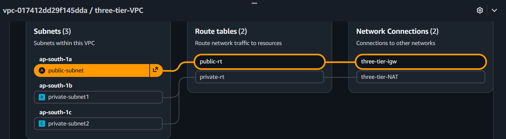
   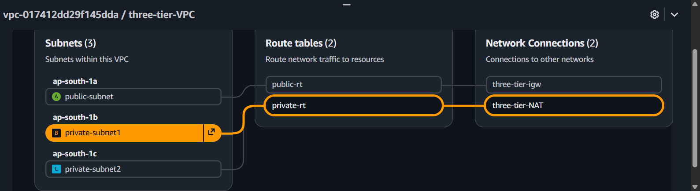
   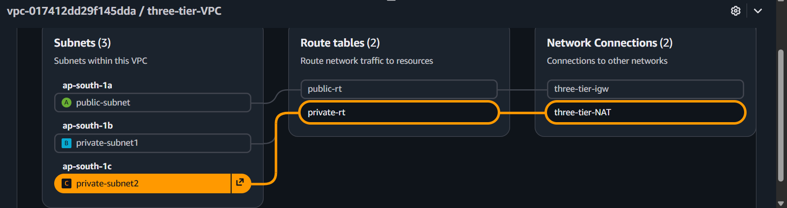

---

### Phase 2: Security Groups & State Firewall Policies

10. **Custom Access Control Lists:** Built a specialized security group mapping (`three-tier-sg`) applying crisp principle-of-least-privilege firewall rules.
    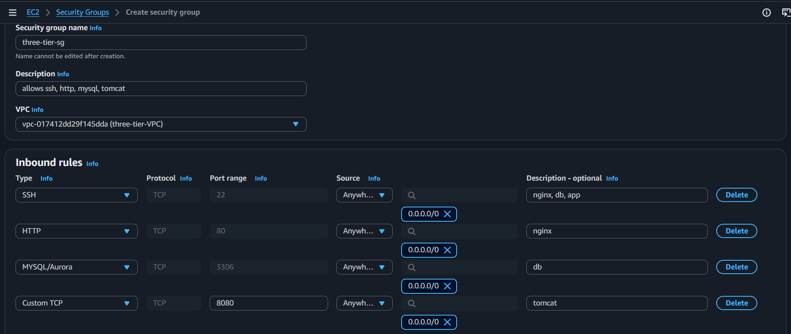

11. **Security Groups Final Index:** Successfully compiled and registered the perimeter guard groups across the resource space.
    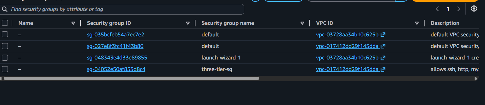

> ⚠️ **Critical Database Firewall Optimization:** The Database tier security settings were locked down to remove generic CIDR blocks (`0.0.0.0/0`). Inbound traffic over Port `3306` is restricted solely to traffic originating from instances wearing the Application Server's explicit security group tag (`sg-048343e4d33e89855`).

---

### Phase 3: Infrastructure Compute Cluster Launch

12. **Managed Instance Deployments:** Created three distinct Amazon Linux 2023 EC2 compute systems to scale out the system:
    * `proxy` (Assigned to Public Subnet for edge traffic handling)
    * `app` (Assigned to Private Subnet 1 for application code container execution)
    * `db-connect` (Assigned to Private Subnet 1 for internal DBA administration tasks)
    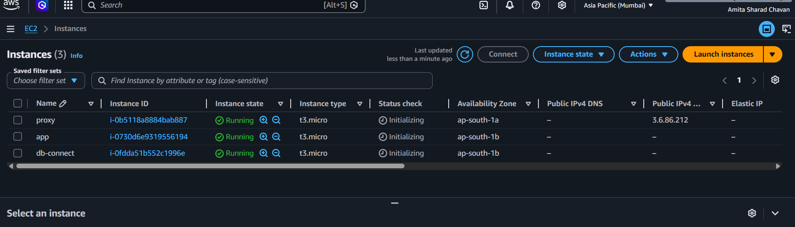

13. **Bastion Security Architecture Setup:** Loaded private identity key pairing credentials (`.pem`) onto the public-facing `proxy` node to construct a secure administrative gateway (Jump Host) to securely log into the isolated private instances.
    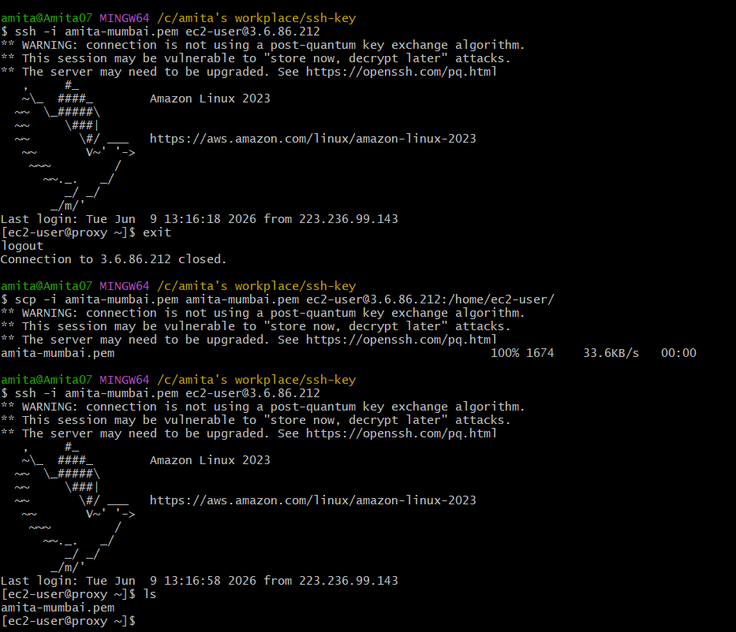
    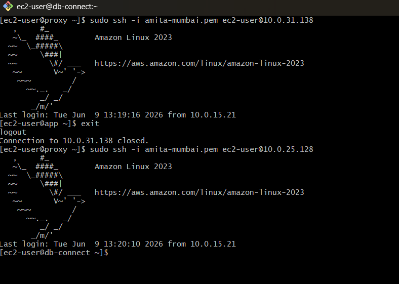

---

### Phase 4: Web Ingress Layer Tuning (Nginx Reverse Proxy)

14. **Nginx System Provisioning:** Executed package mirror synchronization updates on the public edge system before setting up the web proxy layer:
    ```bash
    sudo yum update -y
    sudo yum install nginx -y
    sudo systemctl start nginx
    sudo systemctl enable nginx
    ```
    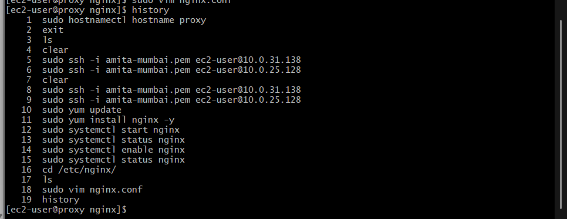

15. **Upstream Request Pathing:** Modified the default configuration matrix inside `/etc/nginx/nginx.conf` via Vim to establish an upstream proxy pass pipeline over port `8080` targetting Tomcat's network runtime:
    ```nginx
    location /student/ {
        proxy_pass [http://10.0.16.138:8080/student/](http://10.0.16.138:8080/student/);
        proxy_set_header Host $host;
        proxy_set_header X-Real-IP $remote_addr;
    }
    ```
    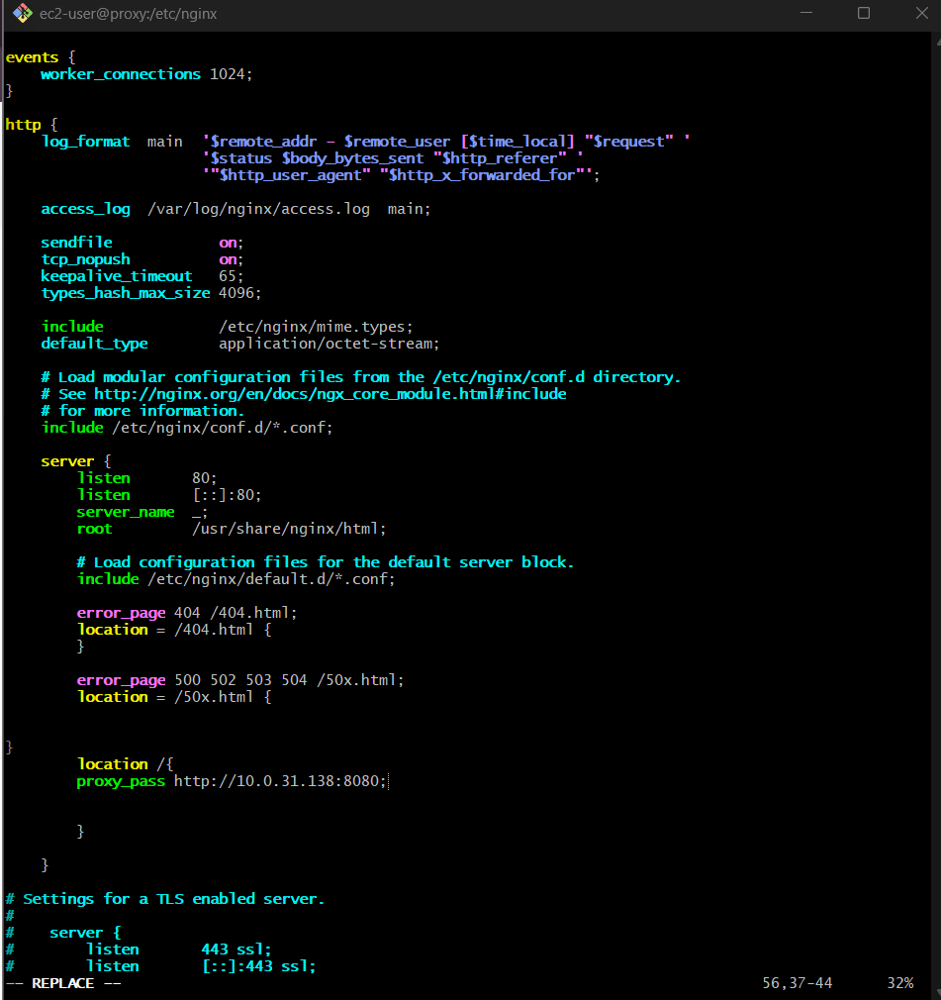

---

### Phase 5: Mid-Tier App Server Assembly (Apache Tomcat 9)

16. **Java Runtime Provisioning:** Logged into the private `app` system over the bastion path and deployed the base Java Enterprise Environment (JEE) runtime dependencies:
    ```bash
    sudo yum install java -y
    ```
    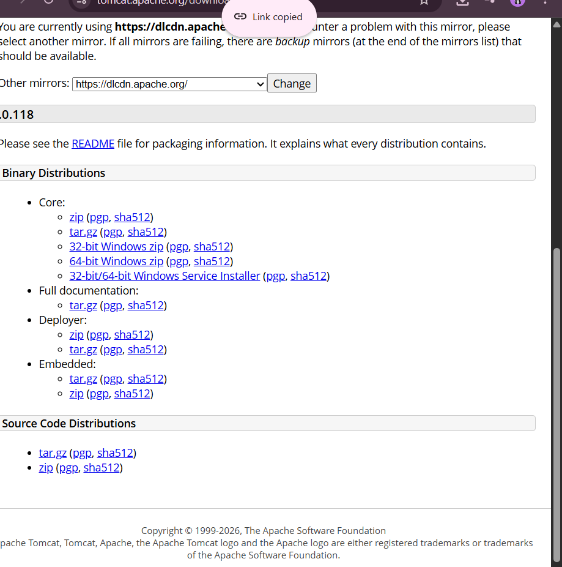

17. **Tomcat Binary Installation:** Used `curl -O` to pull down verified Apache Tomcat 9 distribution packages, untarred the payload, and migrated the runtime system files directly into `/opt/apache-tomcat`:
    ```bash
    tar -xvf apache-tomcat-9.0.x.tar.gz
    sudo mv apache-tomcat-9.0.x /opt/apache-tomcat
    ```
    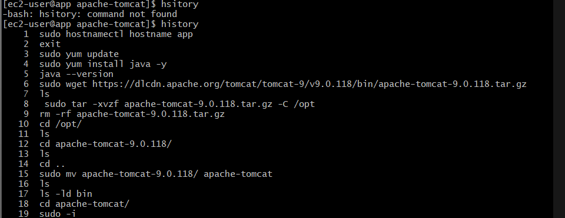

18. **Application Server Daemon Startup:** Initialized the container process context via root execution permissions:
    ```bash
    cd /opt/apache-tomcat/bin/
    sudo ./catalina.sh start
    ```
    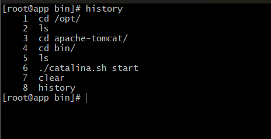

19. **Edge Routing Check:** Verified standard connectivity loop responses through the Nginx public IP mapping.
    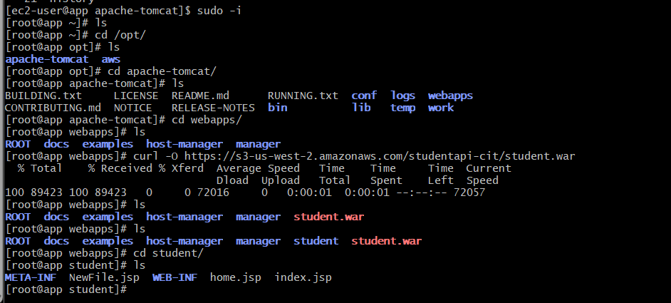

20. **Dynamic Deployment Assembly:** Downloaded the precompiled `student` web registration deployment code bundle straight into Tomcat's deployment directory (`/opt/apache-tomcat/webapps/`).
    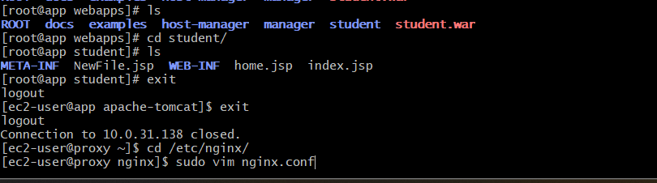
    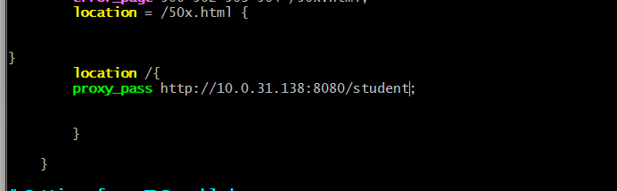

---

### Phase 6: Managed Database Node Realization (RDS MariaDB)

21. **Cloud Database Provisioning:** Created an Amazon RDS database engine running MariaDB (`my-custom-mariadb`) situated inside a Private DB Subnet Group.
    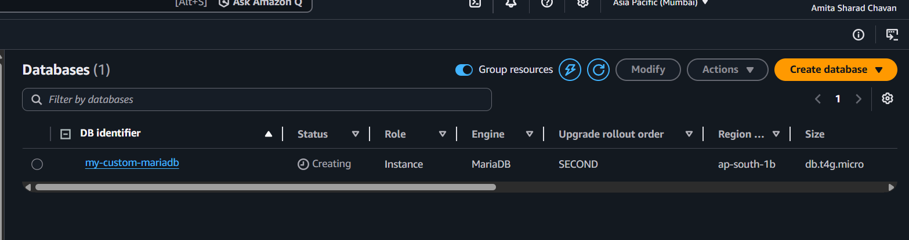

22. **Internal Administrative Connection Handshake:** Used the isolated administrative server (`db-connect`) to open a secure connection line into the database endpoint over Port `3306`:
    ```bash
    mariadb -h my-custom-mariadb.cb8uq6ce4qu7.ap-south-1.rds.amazonaws.com -u admin -p
    ```
    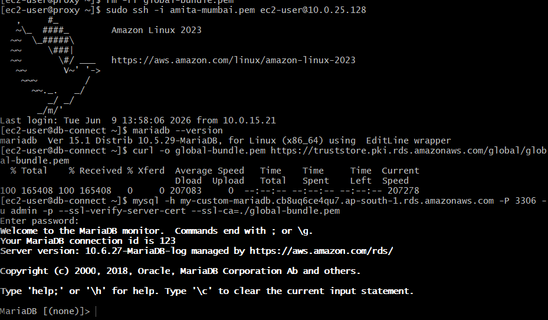

23. **Database Schema Injection:** Injected relational database schemas and structural validation configurations to map out record writes:
    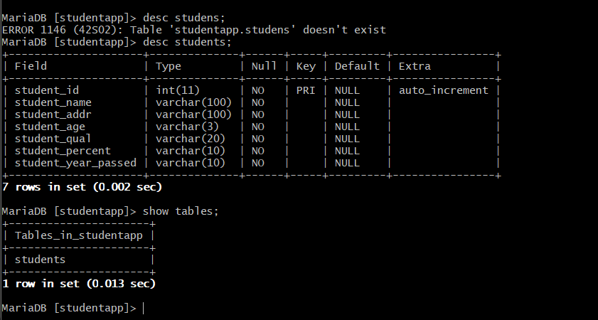

---

### Phase 7: Driver Optimization & JNDI Data Source Integration

24. **Resolving Network Isolation Errors:** Fixed an internal network communication problem caused by cross-subnet lockout rules by updating the RDS Inbound rule settings.
    ![AWS Security Group Inbound Verification Error Screen]
    ![Security Group Configuration Panel Validation Block]

25. **Database Parameter Synchronization:** Modified database security configurations to resolve duplicate rule declarations.
    ![Security Group Port Rule Adjustment Workspace]
    ![Firewall Context Rule Refresh Execution]

26. **Troubleshooting ClassNotFoundException:** Resolved a critical runtime exception (`java.lang.ClassNotFoundException: org.mariadb.jdbc.Driver`) by pulling the MariaDB Java Database Connectivity client jar straight into Tomcat's global library folder:
    ```bash
    cd /opt/apache-tomcat/lib/
    sudo wget [https://repo1.maven.org/maven2/org/mariadb/jdbc/mariadb-java-client/3.1.4/mariadb-java-client-3.1.4.jar](https://repo1.maven.org/maven2/org/mariadb/jdbc/mariadb-java-client/3.1.4/mariadb-java-client-3.1.4.jar)
    ```
    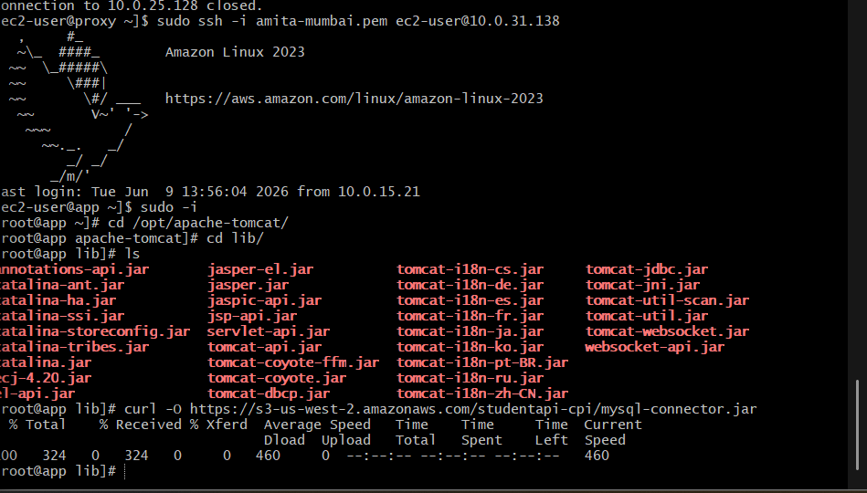
    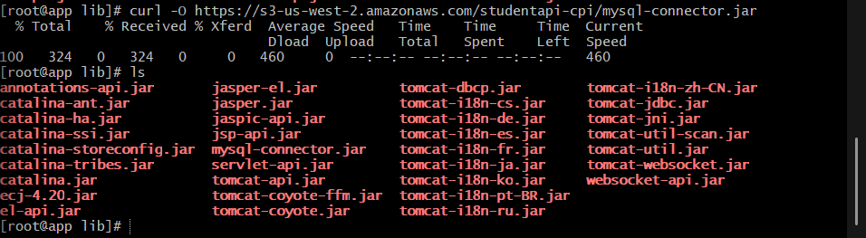

27. **JNDI Context Configuration:** Updated Tomcat's core context definitions (`/opt/apache-tomcat/conf/context.xml`) using the Vim text editor to point to the remote Amazon RDS database endpoint link:
    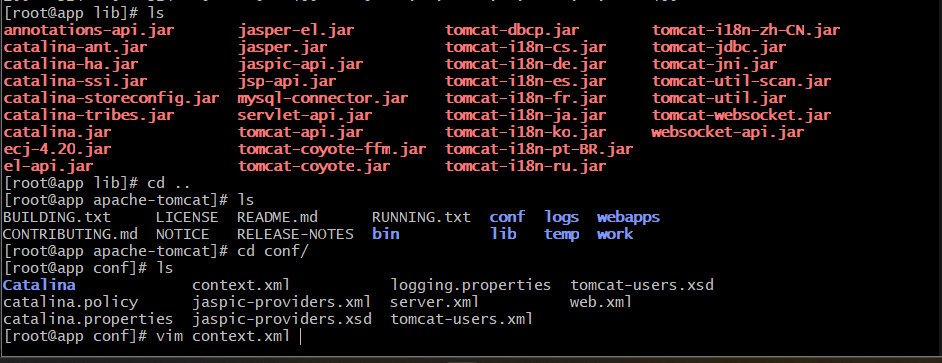
    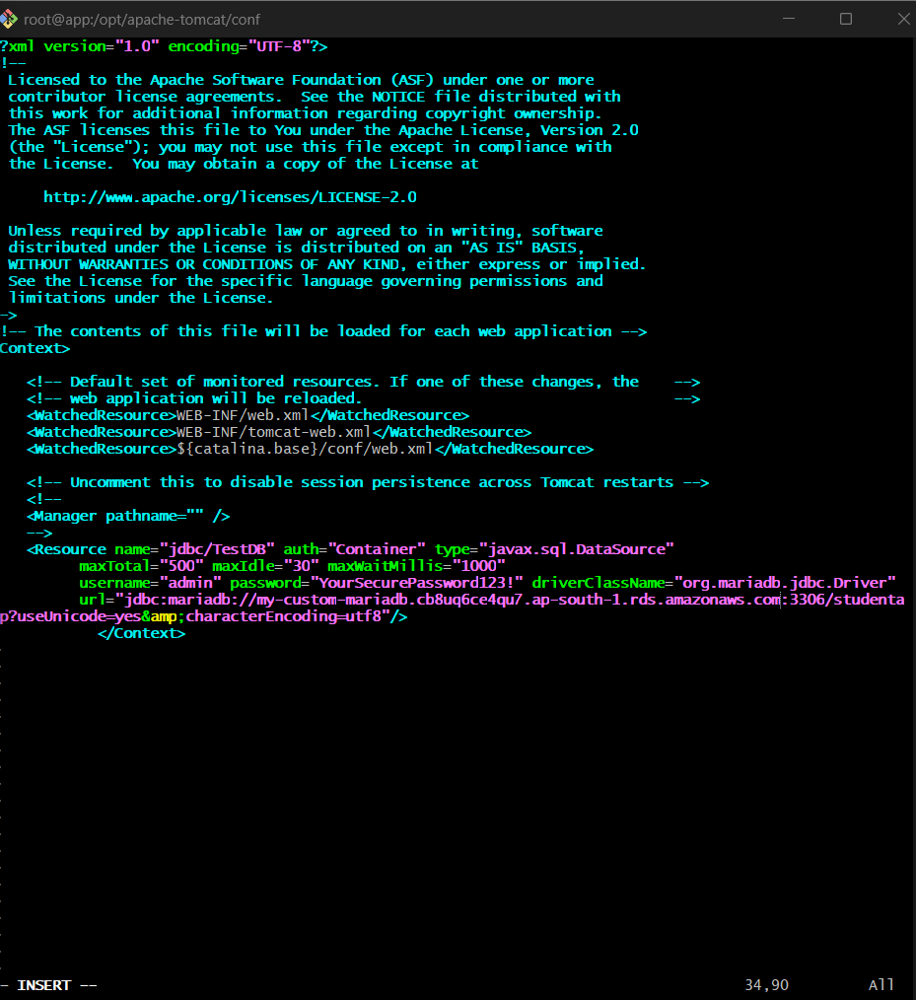

28. **System-Wide Environment Reset:** Cycled all application container daemons and reverse proxy systems to lock in the final properties:
    ```bash
    # Restart Tomcat
    /opt/apache-tomcat/bin/catalina.sh stop
    /opt/apache-tomcat/bin/catalina.sh start
    # Restart Nginx
    sudo systemctl restart nginx
    ```
    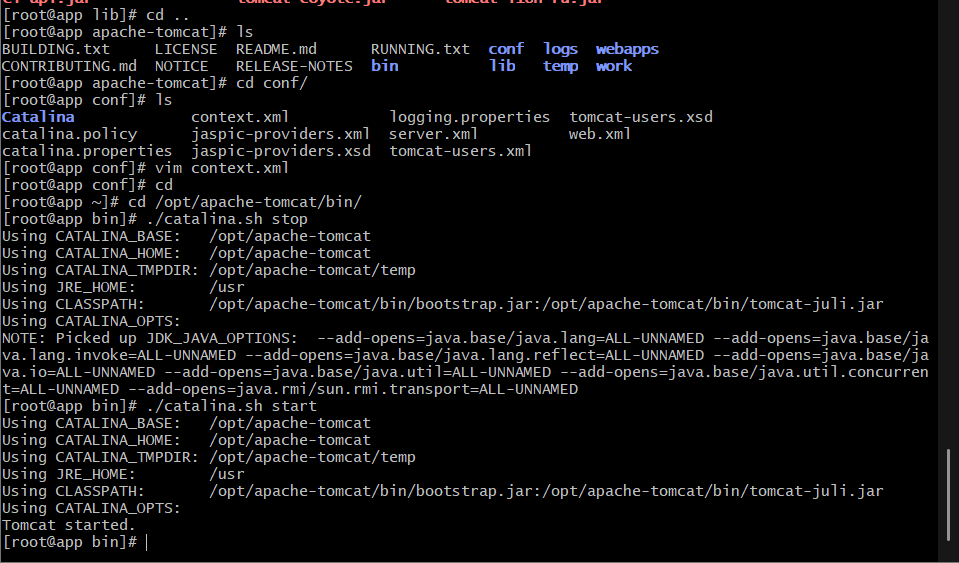

---

## 🚀 End-to-End Operational Verification

By hitting the public entry proxy endpoint using an isolated browser tab (`http://3.6.86.212/student/`), the user is presented with the front-facing Student Registration UI. 

Submitting user payloads transfers information cleanly through Nginx, executes business logic processing inside Tomcat, and creates permanent student data table records within the private MariaDB RDS cluster without errors.

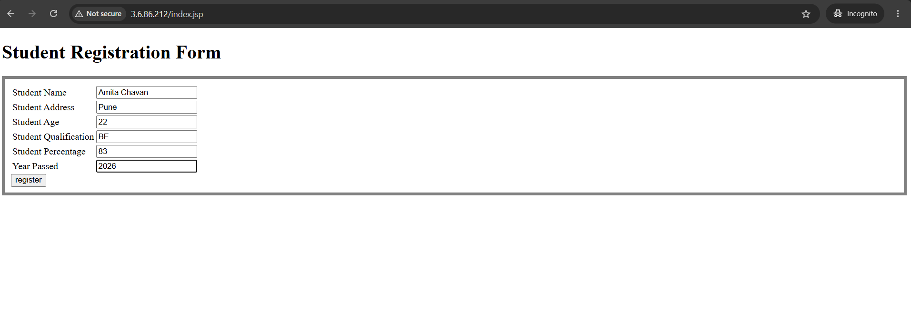
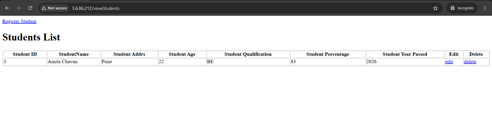
